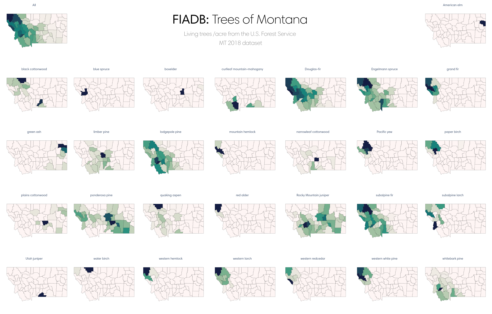
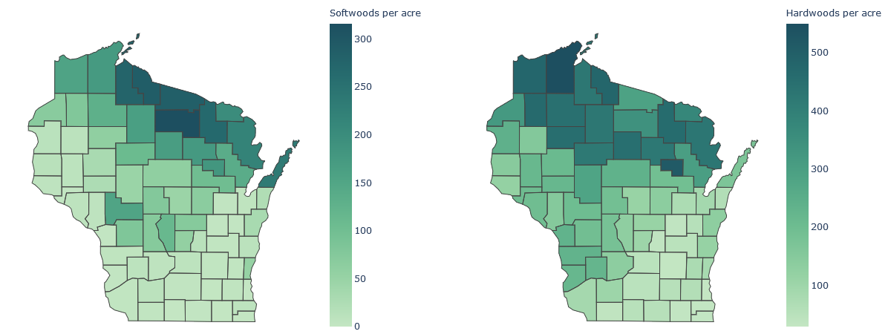
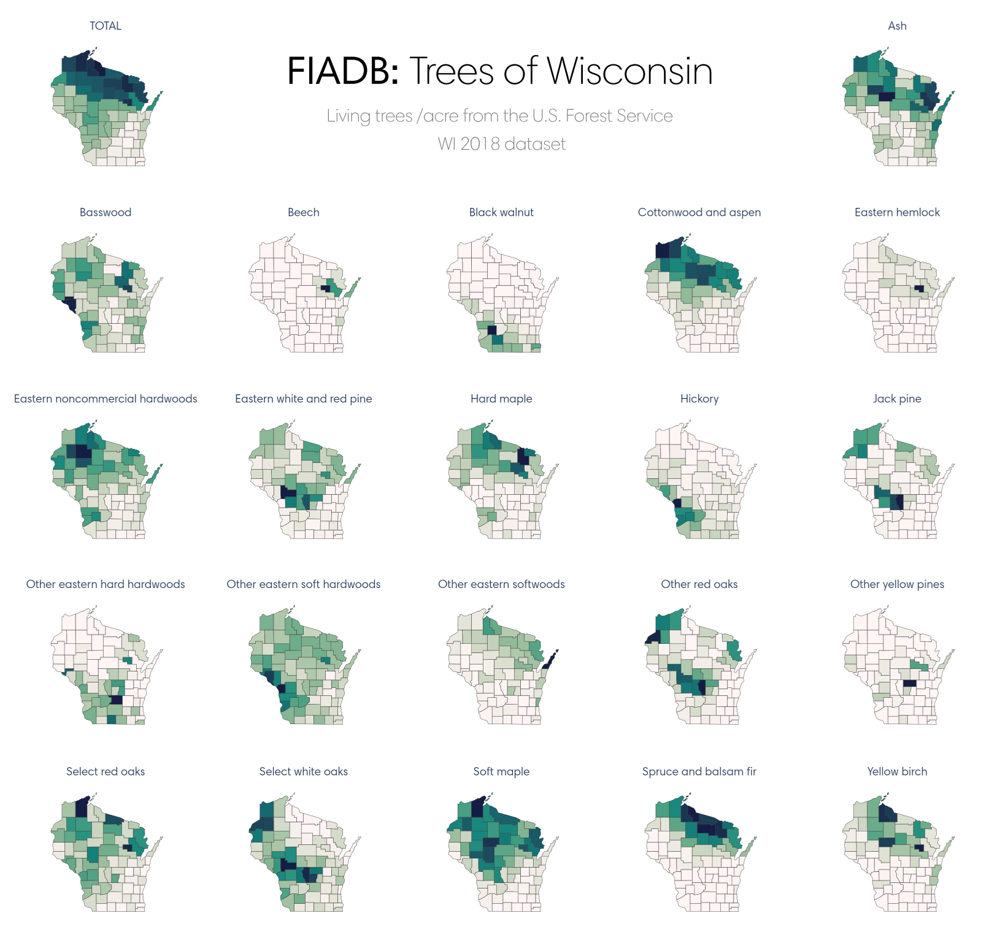

[Demo of results](https://gg314.github.io/usda-fs-fiadb-api/demo/)

## Python USDA Forest Inventory and Analysis Database API Wrapper

This is a fairly simple wrapper to the APIs available from the US Forest Service's <abbr title="Forest Inventory and Analysis Database">FIADB</abbr>.

For an interactive version of trees/per acre by county, see `/demo/index.html`.




## Documentation & Links

* [General FIADB API "documentation"](https://apps.fs.usda.gov/fia/datamart/images/datamart_api_tutorials.html)
* [List of `fullReport` variables](https://apps.fs.usda.gov/fia/datamart/images/Evalidator_variable_library.html)
* [List of `fullReport` population estimates](https://apps.fs.usda.gov/fia/datamart/images/Evalidator_pop_estimates.html) or use `FIADB.fullreport.list_attributes()`
* [Table documentation PDFs](https://www.fia.fs.fed.us/library/database-documentation/)

## Usage

```python
from fiadb import FIADB

client = FIADB()               # or:
client = FIADB(verbose = True) # print HTTP request urls for each query
```

### fullreport Example

Valid fullReport queries can be very difficult to write and parse without testing first on the USDA's Java-based [Evalidator](https://apps.fs.usda.gov/Evalidator/evalidator.jsp).

```python
# Find total number of softwood and hardwood trees by Wisconsin county
trees = client.fullreport.get(
    reptype="State",
    snum="Number of live trees (at least 1 inch d.b.h./d.r.c.), in trees, on forest land",
    wc=552018,
    pselected="None",
    rselected="County code and name",
    cselected="Species group - Major"
)["row]
```
See the visual examples at the bottom of this guide, which were created with data taken from `fullreport` queries.

### evalgrp Example
```python
# Most recent evalGrps for Minnesota, Wisconsin
client.evalgrp.get(whereClause="STATECD IN (55, 27)")
> [272018, 552018]
# All evalGrps for New York
client.evalgrp.get(whereClause="STATECD IN (26)", mostRecent="N")
> [261980, 261993, 262003, 262004, 262005, 262006, 262007, 262008, 262009, 262010, 262011, 262012, 262013, 262014, 262015, 262016, 262017, 262018, 262019]
```

### statecdlonlatrad Example
```python
# State codes within 100mi of Minneapolis, MN
client.statecdlonlatrad.get(lat=45, lon=93, rad=100)
> [55, 27]
```

### reftable Example
```python
# List all unique entries with "walnut" in the common name
walnuts = client.reftable.get(
    tableName="REF_SPECIES",
    colList="common_name, genus, species",
    whereStr="upper(common_name) LIKE '%WALNUT%'\r\n"
)
"\r\n".join(["%s | *%s %s*" % (e['COMMON_NAME'], e['GENUS'], e['SPECIES']) for e in walnuts])
```

| Common Name                      | Species               |
| -------------------------------- | --------------------- |
| West Indian walnut               | _Juglans jamaicensis_ |
| English walnut                   | _Juglans regia_       |
| Indian walnut                    | _Aleurites moluccana_ |
| walnut spp.                      | _Juglans spp._        |
| black walnut                     | _Juglans nigra_       |
| northern California black walnut | _Juglans hindsii_     |
| southern California black walnut | _Juglans californica_ |
| Texas walnut                     | _Juglans microcarpa_  |
| Arizona walnut                   | _Juglans major_       |


## More examples
County-level choropleths (region-shaded maps) are easy to create using a utility like plotly (which has a Python implementation) or Leaflet.

```
> pip install plotly
> pip install psutil requests ipywidgets
# Optionally install orca for exporting static images
```



